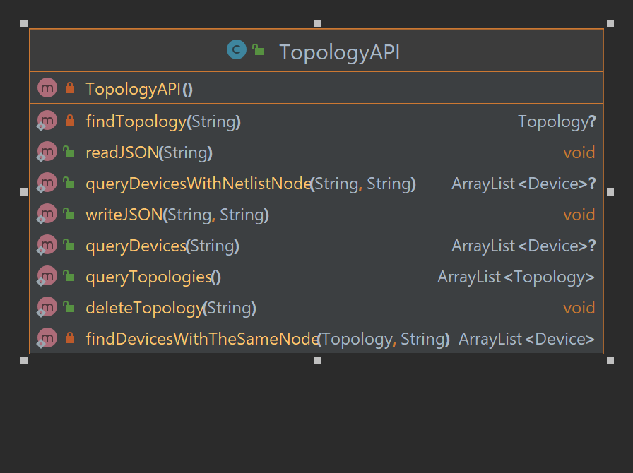
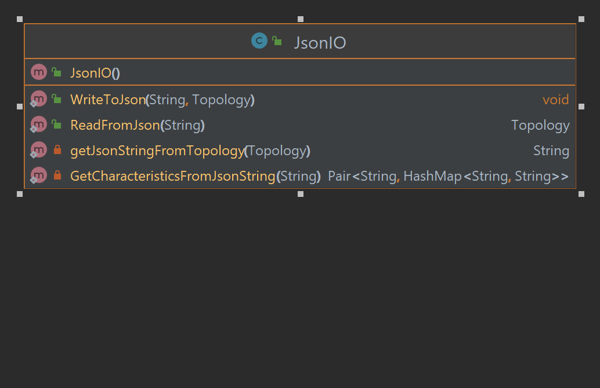
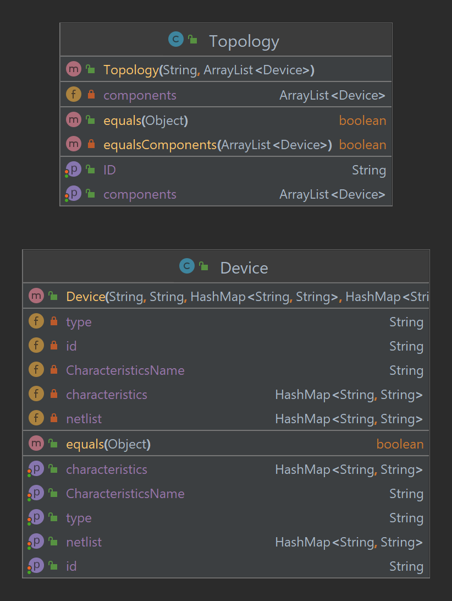

# Topology API
An API to access, manage and store device topologies.You can see a template for a topology from [here](lib/src/test/java/testTopologyAPI/testJSONS/topology.json)
## Prerequisites

1. suitable IDE for JAVA (e.g. Eclipse,IntelliJ)
2. [Gradle](https://gradle.org/) for building the library
3. [Junit4](https://junit.org/junit4/) for testing 
4. [Gson](https://sites.google.com/site/gson/gson-user-guide) for parsing the JSON file

## API Features
1. Read a topology from a given JSON file and store it in the memory.
2. Write a given topology from the memory to a JSON file.
3. Query about which topologies are currently in the memory.
4. Delete a given topology from memory.
5. Query about which devices are in a given topology.
6. Query about which devices are connected to a given NetList node in
   a given topology.

## Getting Started

- Import `topologyAPI` package in your program, ex:
```
import TopologyAPI.*;
```

## API Documentation
The API mainly consists of 3 classes as follows:
* **TopologyAPI Class**: represents the interfacing class to access the API features.
* **JsonIO Class**: Provides TopologyAPI with helper methods to manipulate JSON files.
* **DataBase** Class: represents the storage layer for the API.

**The UML Diagram for TopologyAPI and JsonIO**




## TopologyAPI Documentation:

**readJSON(String FilePath):**
- Description: read topology from the given JSON file.
- Parameters:
   1. `FilePath`: the path of the given JSON file.
- Return: `void`.

**writeJSON(String TopologyId,String FilePath):**
- Description: writes the given topology in a JSON file.
- Parameters:
   1. `TopologyId`: the ID of the topology that wanted to be written into disk as a JSON file.
   2. `FilePath`: the path of the file that the topology will be written into.
- Return: `void`.

**queryTopologies():**
- Description: gives the user a copy of the list of topologies currently stored in memory.
- Parameters: `void`.
- Return: `ArrayList<Topology>`.

**queryDevices(String TopologyId):**
- Description: gives the user a copy of the list of the components of the given device.
- Parameters:
   1. `TopologyId`: the ID of the topology to query its components.
- Return: `ArrayList<Device>`.

**queryDevicesWithNetListNode(String TopologyId,String NetListNodeID):**
- Description: gives the user a copy of the list of components that are connected to the given node.
- Parameters:
   1. `TopologyId`: the ID of the topology.
   2. `NetListNodeID`: the given node to query components connected to it.
- Return: `ArrayList<Device>`.

**deleteTopology(String TopologyId):**
- Description: delete the given topology from the memory.
- Parameters:
   1. `TopologyId`: the ID of the topology that will be deleted.
- Return: `void`.

## Classes Documentation
**The topologies stored in memory is modeled with the following classes:**

- ***Topology Class:*** It models the topology as an ID and an array of devices, each element in this array is of type `Device`.
- ***Device Class:*** It models the device as an ID, type, characteristics and NetList.

**The UML Diagram of Topology and Device Class:**

